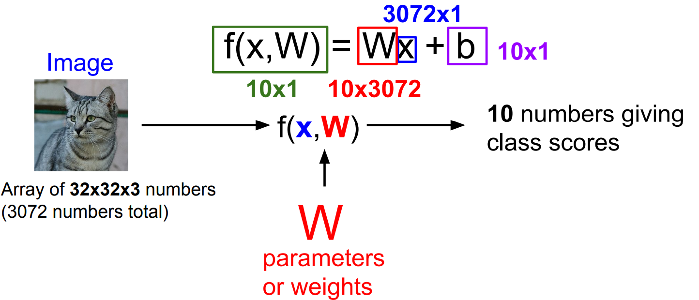
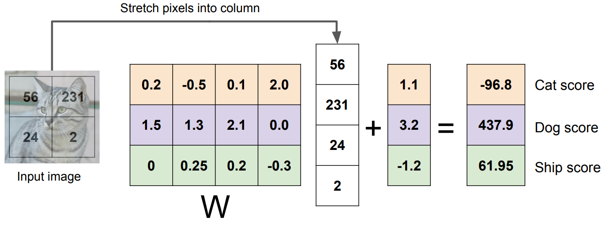

## 퍼온 블로그
https://chacha95.github.io/2018-11-15-Deeplearning1/

## 선형 분류 이론 공부

### Linear Classification이란?

- Linear Classification(선형 분류)란 쉽게 말해서 선을 이용하여 집단을 두개 이상으로 분류하는 모델이다.

- 이런 선을 단 한개 사용해서 두개의 class로 분류 할 경우 binary classification이라고 부른다.

### multinomial classfication

- 하지만 실제 세상에서는 binary하게 분류하는 문제는 거의 없고 입력값에 대해 여러 class 중 하나를 택해 분류 하는 문제가 대다수이다.

- 아래 그림은 3가지 클래스에 대해 linear classification한 예시이다.

### Linear Classifier

- Linear Classifier는 어케 작동을 할까?

- cho ez한 Linear Classifier를 하나 생각해보1자

- RGB컬러 이미지 차원은 (width x height x channel)이다. 만약 32x32크기의 이미지를 분류한다고 한다면 32x32x3 = 3072차원이 된다.

그 다음에는,

3072차원의 벡터에 Linear Classifier의 Weight matrix와 matrix multiplication을 해주면, 우리가 분류해야 할 class 만큼의 결과 값이 나온다. 여기서 class의 총 개수가 10개 이므로, Wx의 결과값은 10개가 나오게 되고, 여기에 bias 텀을 더해주게 되면, Classifier가 예측한 값이 나오게 된다. <-- 솔직히 처음에는 알아먹기 좀 힘들었다

사진을 보면서 이해해보자

간략하게 표현한게 아래다, 아래는 그림이 2x2x1인 경우로 표현한 것이다

중간에 W라고 되어있는 행렬이 Weight matrix라는 것인데 각 행은 각각의 클래스를 나타내고 열은 각 차원에 대한 가중치 값을 나타낸다 (만약 이미지가 32x32x3이라면 열의 길이는 3072이겠죠?)

만약 모델이 분류해야할 클래스가 10개이고 이미지를 위에서 정한 것처럼 32x32라고 가정하면

- weight matrix의 크기는 10x3072가 된다. 그 후, 이미지를 3072x1로 표현하고 이 두 개를 행렬곱(matrix multiplication <- 괜히 어렵게 써놨다)하면 각각의 클래스에 대한 값들이 나올텐데 각각의 클래스에 해당하는 bias를 더하면 각 클래스에 대한 최종 score가 나오게 된다.

- 가장 score가 높은 클래스를 이미지의 클래스로 정한다.

### 단점

- 픽셀 값들을 행렬 계산하여 결과를 도출하기 때문에 Color에 너무나도 민감하다

- 공간에 대한 정보를 이용하지 못한다.

- knn과 마찬가지로 아직도 Semantic Gap을 극복하지 못한다.