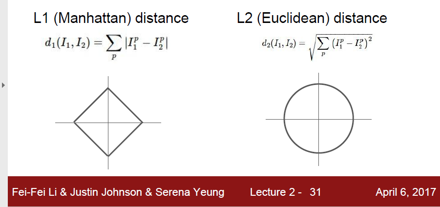
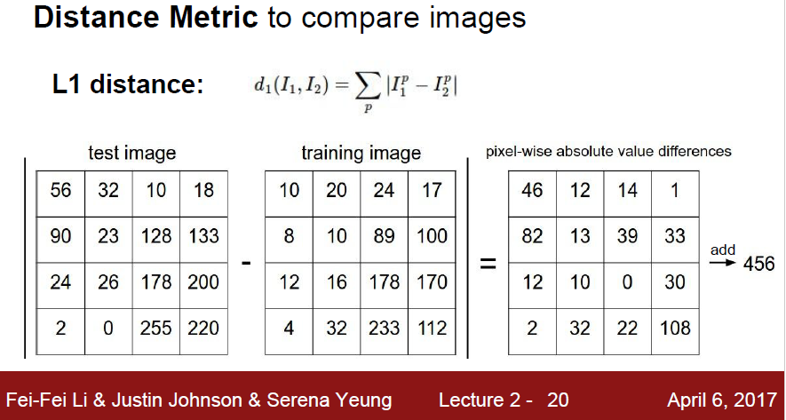
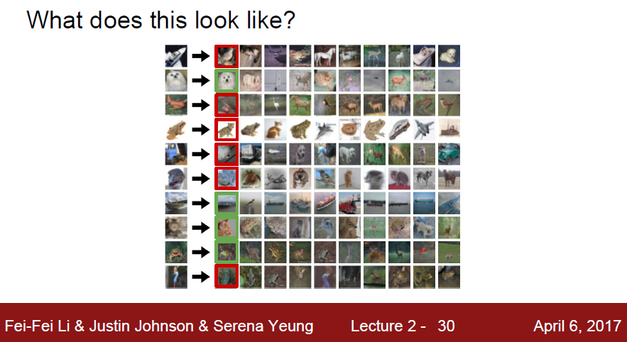
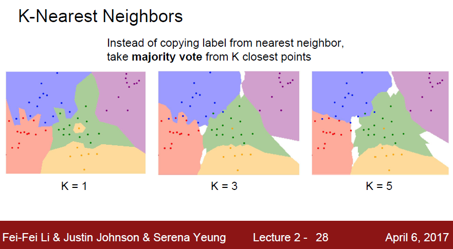
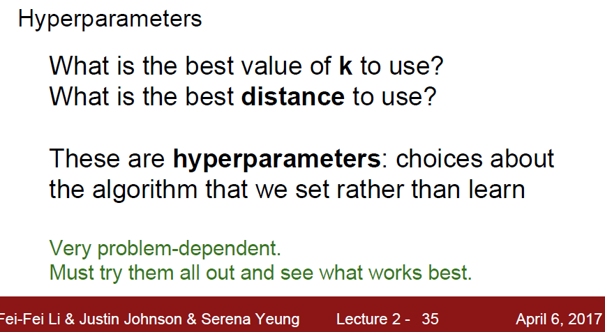
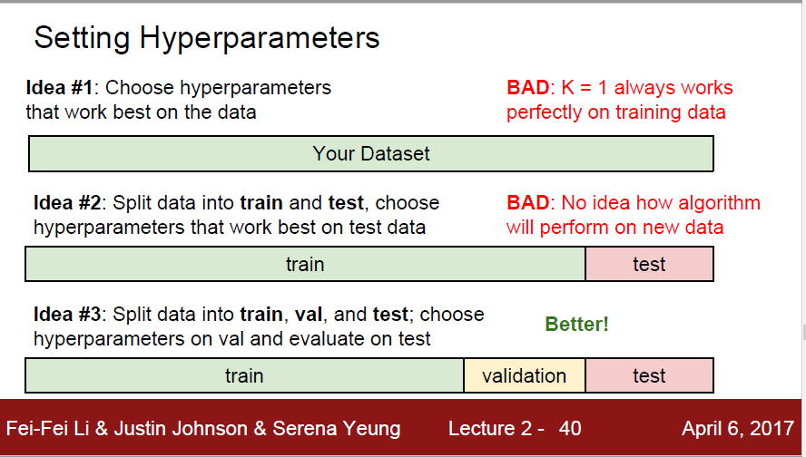
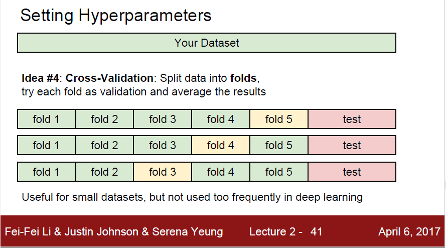
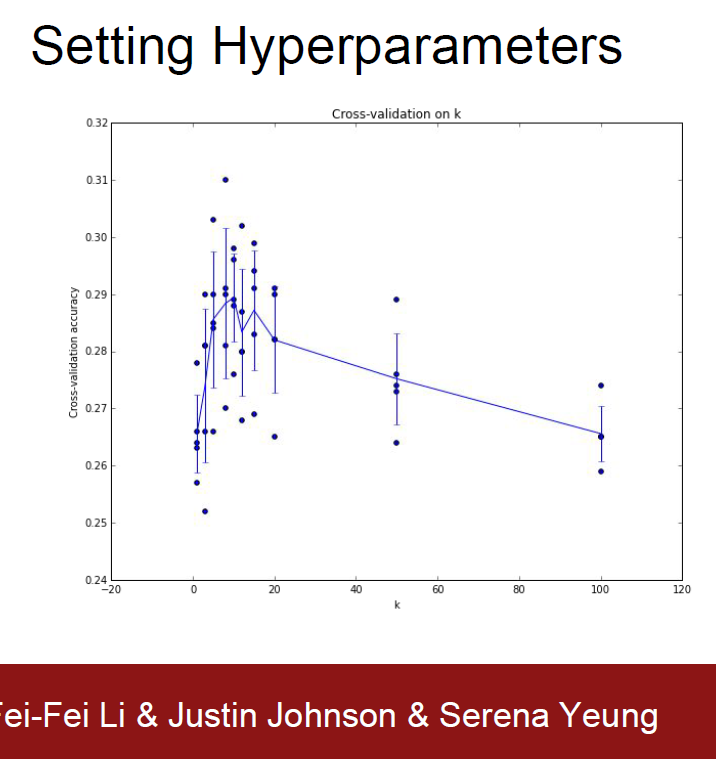

## K-NN 이론 공부

### 지도학습에 속하는 K-NN
----

- 먼저, K-NN(Nearest Neighbor) 알고리즘은 머신러닝 알고리즘 중 지도학습에 속한다. 지도학습이란, 쉽게 말해 데이터와 함께 데이터의 레이블(답)을 주고 학습을 시키는 것이다

- 지도학습은 크게 회귀(Regression)와 분류(Classfication)로 나뉘는데, K-NN알고리즘은 분류에 속한다.

- K-NN은 Data-driven approach(데이터 기반) 기반이다.

### K-NN 알고리즘이란?
----

- 이 알고리즘을 쉽게 설명하자면, 유유상종이라고 할 수 있다. 

- 비슷한 특성이나 속성을 가진 것들끼리는 가깝게 모여있기에, 한 데이터의 주변에 어떠한 데이터들이 있는지를 확인하고 어떤 데이터인지를 분류하는 것이다

- K-NN을 풀어쓰자면 K-Nearest Neighbor이라고 한다. 말 그대로 K개의 가까운 이웃 데이터를 기반으로 분류한다. (뭐 K-최근접 이웃이라고 하는 것 같다)

- 가장 가까운 K개의 데이터 중, 가장 빈도가 높은 레이블을 분류 대상인 데이터의 레이블로 정한다.

- 만약, 레이블의 빈도가 동률인 상황에는 랜덤선택이나 더 가까운 것을 사용하지만, 애초에 이런 상황을 만들지 않기 위해 K를 홀수로 설정하는 경우가 대부분

#### 거리기반 분류분석 모델

- K-NN 알고리즘은 얼마나 가까운지에 대해 거리를 이용한다. 거리가 짧을수록 더 가까운 이웃이된다

#### 거리 측정 방법

1. 맨해튼 거리(Manhattan Distance)

2. 유클리드 거리(Euclidean Distance)



- L1 : pixel 값들의 차이가 클 때 좋다

- L2 : pixel 값들의 차이가 미미할 때 좋다



- 이미지 데이터일 경우 성능이 매우 좋지 못한다. 위 이미지를 보면 알듯이 저러한 거리 계산을 모든 데이터셋에 대해 계산하여 비교하여야한다.

- 위 두 가지 말고도 더 많은 거리 재는 방식들이 있다고는 한다.

### k-Nearest Neighbor Classifier (kNN 분류기)

----

NN 분류기는 아래처럼 가장 비슷한 사진(가장 거리가 짧은 사진)을 찾는 것이다.



NN의 단점은 최근접 이웃이 틀리다면 misprediction을 하게 된것이다.
이런 misprediction을 줄이기 위해서 kNN을 사용하면 좀 더 정확한 것을 찾을 확률이 올라갈 것이다.
top k의 근접한 이웃을 찾는 것이기에, NN은 k=1인 knn이라고 생각할 수 있다.

가끔 데이터들 중에서 outlier(이상치)들이 있다. 같은 분류이지만 조금 특이한 값들을 oulier들이라고 볼 수 있다.

*outlier : 비정상적으로 벗어난것들. 예를들어 IQ 평균이 50이라고 가정하면 어떤사람만 300일때 그 사람을 제외시켜야 좀 더 정확한 값을 얻을 수 있는것처럼..



이 사진은 L2 distance를 사용한 분류기로 만든 decision boundaries(결정 경계)이다.

하얀색 지역은 모호하게 분류된 경우이다.(적어도 2개이상의 클래스들이 투표수가 같은경우)

NN에는 흰색 경계가 나올 수 없는 이유이기도 하다.    

위의 사진을 보면 k=1일때(NN)는 outlier들을 처리하지 못해서 초록색 안에 노란색 섬(island)이 있다. 이런 것들이 incorrect prediction을 하게 만든다. 

반면 k=5인건 이러한 irregulation(outlier 같은것들)이 생기지 않게 좀 더 부드럽게 만들어준다.

사진을 보면 흰색 바탕이 있다. 이런것들은 (red 2표,green 2표, blue1표) 이런식으로 동률의 투표가 있는 경우에 저런식이다.

### Hyperparameter 튜닝을 위한 Validation Set(검증 셋)

----



K를 몇으로 설정할지? distance는 어떤걸로 쓸지?? 이런걸 선택해야 한다.
distance도 L1,L2외에도 여러가지 방법이 있다.

이러한 선택을 Hyperparameter라고 한다. 
이런 하이퍼파라미터는 data로부터 학습된 머신러닝 알고리즘에서 나타난다.

**어떠한 값을 사용할지는 항상 명확하지 않다**

가장 심플한 방법은 그냥 K를 여러값을 넣어보면서 돌린 후에 그 결과로 K를 결정하는 것이다, 좋은 아이디어이고 실제로 그렇게 하지만 매우 조심해야한다.

hyperparameter를 수정할 목적으로 test set을 절대 사용해서는 안된다고 한다. 이론상 ML 알고리즘을 만들 때 test set을 알고리즘 테스트 때 딱 한 번 외에는 절대 사용해서는 안될 소중한 자원으로 생각해야 한다. test set을 맞추기 위해서 hyperparameter를 수정하면 실제 모델을 배치했을 때 상당한 성능 감소가 나올 수 있다.
-> 테스트 셋에서만 굴러가게 하지 말고 범용적인걸 고려해야한다.

*Overfit(과적합)
test set에다가 hyperparameter를 맞추는 걸 overfit했다고 한다.
이걸 다른 관점으로 보면 test셋을 training set처럼 사용한 것이다.
따라서 실제로 모델을 배치헸을 때 나올 accuracy(정확성)보다는 굉장히 optimistic(낙관적인?)한 값이 나올 것이다.

기출문제를 풀고 나서 시험을 보면 점수가 잘 나오지만, 새로운 시험지를 받는다면 점수가 이전보다 낮게 나올 확률이 매우 크다(신유형)

따라서 알고리즘을 평가하는 마지막에만 test set을 사용해야 test set이 우리가 만든 classifier의 일반화된 성능을 평가하는 척도, 대용폼(proxy)가 될 것이다.



Idea 1 은 내 dataset에서만 잘 되는 k를 구하면

새로운 dataset에서 성능하락이 나올 수 밖에 없다.

idea 2는 train을 하고 test하면서 hyperparameter를 맞추면 (위에 말한것처럼) 알고리즘이 새로운 data에서 어떻게 작동하는지 알 수 없다.따라서 이것 또한 성능 하락이 날 수 밖에 없다.

idea 3은 train data를 train과 validation set(검증 셋) 으로 나누어서 사용하는 것인데 아래에서 내용을 기술할 것이다.

----

ex)
5만장에 traing set이 있다고 할 때 이 중, 1000장은 validation set으로 사용한다.

49000장은 training set, 1000장은 validation set으로 사용한다.

*validation set (검증 셋)

validation set은 hyperparameter를 설정하기 위한 fake test-set으로 사용한다.(필수적)

test 하기 전에 미리 테스트를 해보는 set 이라고 생각된다.

----

#### 교차검증

- trainging set이 적을 때 사용하면 좋은 방법이다.

- 비교적 앞에 소개된 방법들에 비해 좀 더 정교한 튜닝 기술이다.

- training set을 n개의 fold로 나누고 각각의 fold를 validation으로 삼아 각각 검사해서 평균적인 성능을 낸다.

- 이후, 어떤 k가 더 좋고 noise가 더 적은 결과를 낼지 예측하는 것이다.

n-fold cross-validation이 있는데 여기서 fold는 하나의 그룹 으로 보면 된다.

5-fold cross-validation 을 예시로 보자



Training Data를 n개의 fold 로 나누고 1개는 validation set, n-1개는 training 으로 사용한다.

​
5개를 예로 들면

1. fold5 가 validation set 이라고 하자.

A,B,C,D 는 training set으로 쓰고 E를 test set처럼 사용한다.

그러면 (A,B,C,D), E  에서 성능을 한번 낸다. 그 다음 정밀도 A1 을 구한다.

2. fold4 가 validation set 이라고 하자.

(A,B,C,E) , D 로 성능을 또 낸다. 그다음 정밀도 A2를 구한다

3. fold 3에대해 같은 작업 수행

4. fold 2에 대해 같은 작업 수행

5. fold 1에 대해 같은 작업 수행

그렇게 되면 5개의 정밀도가 나오고 그것의 평균을 구한다.

그렇게 하면 최종 분류 정밀도가 나오게 된다.

​
아래 결과를 보고 이해해 보면 된다.



5-fold 니까 각 k 별로 5개의 결과가 나올것이다.

각 점(dot)은 결과이고 막대기는 표준편차를 나타낸다. 선 들은 평균을 나타낸다.

k마다 점이 5개이고 k=7 쯤에 제일 평균도 높고 accuracy가 0.31정도 되는걸 볼 수 있다.

따라서 kNN에서 최적의 k라고 생각하고 사용하면 된다.

그러면 k-fold cross validation만 쓰면 되는것 아닌가? 라고 생각할 수 있다.

#### 그럼 교차검증만 사용하면 안되는걸까?

안된다. 데이터셋이 커질수록 엄청난 시간이 필요하다.(계산량이 너무 많다.)

### K-NN 알고리즘의 장단점
----

- 장점
1. 단순하고 효율적
2. 기저 데이터 분포에 대한 가정을 하지 않는다
3. 훈련 단계가 빠르다
4. 수치 기반 데이터 분류 작업에서 빠르다

- 단점
1. 모델을 생성하지 않아 특징과 클래스 간 관계를 이해하는데 제한적이다
2. 적절한 k의 선택이 필요하다
3. 데이터가 많아지면 분류 단계가 느리다
4. 명목 특징 및 누락 데이터를 위한 추가 처리가 필요하다

실제 구현할 시 training time은 매우 짧다 O(1), 그냥 배열에 넣고 index화 한다. 끝

하지만 그 후 사용에 엄청난 시간을 소모한다. 실제 사용시에는 test time에서 드는 시간이 줄어드는 것을 중요하게 생각한다. 따라서 실사용에는 부적합하다.

deep neural network는 NN과는 완전 반대이다. training이 길고 test가 짧다. 이런 방식이 더 현실적인 방식이다.

----

NN 분류기의 연산량은 아직도 연구가 되는 주제라고 한다. (2017년 게시글인데.. 지금도 하려나..)

ANN(Approximate NN) 근사 최근접 이웃 알고리즘이나 라이브러리들이 있어서 이것들이

dataset 내에서 NN을 찾는걸 가소고하 해준다.

이러한 알고리즘들은 정확도를 조금 포기하고 시/공간 복잡도에서 이득을 크게 본다.(NN을 찾을때에)

kdtree를 만들거나 k-means 알고리즘을 실행할때 사용하는 전처리 stage에 의존하는 편이다.

----

NN은 차원이 낮은 데이터에서는 좋은 선택이 될 수 있다고 한다.

하지만 실생활 이미지 분류에서는 거의 쓰일 일이 없다.

왜냐하면, 실제는 고차원 물체이기에 pixel의 수도 많고, 고차원의 distance는 직관적이지 않기 때문이다.

### K-NN 알고리즘을 구현할 시에 주의점
----

- K-NN과 같은 거리기반 모델의 경우에는 구현 시 변수 값의 범위를 재조정 해주어야한다. 

- 거리를 잴 때에는 숫자를 다루므로 변수 값 범위를 재조정을 해주어야 변수의 중요도를 고르게 해석할 수 있다.

예를 들어 우리가 음식을 단맛과 매운맛으로 분류한다고 가정하면

변수 A는 단맛을 표현하고 값의 범위가 1~10이고, 변수 B는 매웃맛을 표현하고 값의 범위가 1~1,000,000일 때 거리 함수에는 변수B가 훨씬 더 많은 영향을 미치고, 이 때 조정을 거치지 않으면 대부분의 데이터를 매운맛으로 구분하게 된다.
```
변수 A(단맛)      변수 B(매웃맛)
1~10              1~1,000,000
```

#### 변수 값 재조정 방법

1. 최소-최대 정규화(min-max normalization)
2. z-점수 표준화(z-score standardization)

----

##### 최소-최대 정규화(min-max normalization)

최소-최대 정규화는 변수의 범위를 0%에서 100%까지로 나타낸다. 공식은 다음과 같다.

Z=(X−min(X))/(max(X)−min(X))

----

##### z-점수 표준화(z-score standardization)

z-점수 표준화는 변수의 범위를 정규분포화하여 평균을 0, 포준편차가 1이 되도록 한다. 공식은 다음과 같다.

Z=(X−평균)/표준편차

----

이 중, z-점수 표준화를 많이 사용한다. 왜냐하면, 0~100%로 나누는 최소-최대 정규화를 사용하였을 때, 예측할 데이터셋에서 최소-최대에 들지 않는 범위에 벗어난 값이 충분히 있을 수 있기 때문이다.


2일 동안의 NN방식의 공부가 끝나지는 않았다. 선형 분류에 대한 공부가 끝나지 않았다 (선형대수학을 조금 더 공부하고 공부하는 것이 낫다고 생각한다.) 
나중에 한 번 제대로 짜임새 있게 정리해야겠다

**참고한 곳들**
- https://velog.io/@jhlee508/%EB%A8%B8%EC%8B%A0%EB%9F%AC%EB%8B%9D-KNNK-Nearest-Neighbor-%EC%95%8C%EA%B3%A0%EB%A6%AC%EC%A6%98
- https://blog.naver.com/rbals0445/222207195828

**더 공부할 것**
- https://rbals0445.tistory.com/15
및 실습