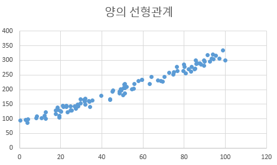
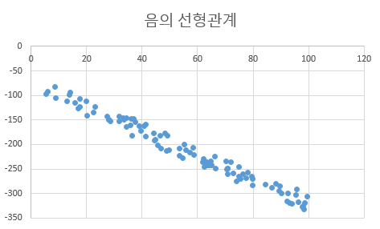
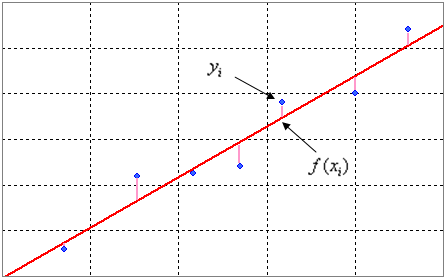

## 참고한 블로그
https://m.blog.naver.com/PostView.naver?isHttpsRedirect=true&blogId=yunjh7024&logNo=220819925829

https://hayden-archive.tistory.com/303

https://hleecaster.com/ml-linear-regression-concept/

## 선형관계

- 선형관계는 두 데이터 값사이에 직선식의 형태가 있으면 선형관계가 있다고 한다. 
- 선형관계는 영어로 Linear Relationship 이므로 직선과 어떤 연관이 있다는 것을 알 수 있다. 
- 산포도가 데이터들간에 어떤 관계가 있는지 파악하기 위한 가장 기초적인 도구가 된다.
- 그렇다면 어떤 형태의 산포도가 그려져야 선형관계가 있다고 판단될까?

<양의 선형관계>

위의 산포도와 같이 데이터가 분포된 형태가 

마치, Y = aX+B  [여기서 a는 양의 정수]

의 형태로 나타날 때 독립변수와 종속변수에는 양(+)의 선형관계(Positive linear relationship)가 존재한다고 한다.

<음의 선형관계>

반면에 이렇게 산포도가

Y = -aX+b [여기서 a는 양의 정수]

의 형태로 그려질 때 독립변수 X와 종속변수Y는 음(-)의 선형관계(Negative linear relationship)가 존재한다고 한다.

----

- 간단하게 알아보고 선형 회귀로 바로 넘어가자

----

## 선형회귀

### 선형회귀란?

머신 러닝의 가장 큰 목적은 실제 데이터를 바탕으로 모델을 생성해서 만약 다른 입력 값을 넣었을 때 발생할 아웃풋을 예측하는 데에 있다.

이때 우리가 찾아낼 수 있는 가장 직관적이고 간단한 모델은 선(line)이다. 

그래서 데이터를 놓고 그걸 가장 잘 설명할 수 있는 선을 찾는 분석하는 방법을 선형 회귀(Linear Regression) 분석이라 부른다.

예를 들어 키와 몸무게 데이터를 펼쳐 놓고 그것들을 가장 잘 설명할 수 있는 선을 하나 잘 그어놓게 되면, 특정 인의 키를 바탕으로 몸무게를 예측할 수 있다.

일단 당연히 정확하지 않다. 선 하나로 표현하기에는 너무 데이터가 흩뿌려져 있다. 웬만해서는 위에서 설명한 선형관계에 존재하는 데이터로 하는 것이 나을 것이다.

선형 회귀 분석의 목표는 y = ax + b라는 1차 함수에서 데이터를 가장 잘 표현할 수 있는 a와 b를 찾는 것이다.

### 손실함수

손실 함수( Cost Function / Loss Function )

위 그래프에서 빨간색 선이 예측한 값, 파란색 점이 실제값. 분홍색 선이 오차를 나타내는데, 이 격차가 좁을수록 정확도가 높다. 

먼저, 기울기 값과 y절편 값을 a와 b로 두고 식을 짜면 아래와 같이 된다.

$y_i=ax_i+b$

손실함수를 나타내는 방법이 두 가지가 존재하는데, 평균제곱오차와 평균 절대 오차가 존재한다. 

#### 평균 제곱 오차(Mean Squared Error)
$MSE$ = $1\over n$ $\displaystyle\sum_{i=1}^{n}{(\^{y_i}-y_i)^2}$

#### 평균 절대 오차(Mean Absolute Error)
$MAE$ = $1\over n$ $\displaystyle\sum_{i=1}^{n}{\vert x_i - x \vert}$

이 두 가지 함수의 값이 0에 가까우면 가까울수록 좋은 a와b라고 정의할 수 있다.

이 중, 평균 제곱 오차(이하 MSE)더 많이 사용하는데, 그 이유는 아래와 같다.

1. 미분이 쉽다. 절대값은 미분하기 매우 귀찮음
2. 격차가 커져서 극대화된다, 예측을 제대로 하지 못했을 때 페널티가 크다.

### 최적의 a b 찾기

일단 손실함수의 값이 최소가 된다면 그 선형방정식은 그 데이터의 선형관계를 가장 잘 나타냈다고 생각할 수 있다.

그렇가면 어떻게 손실함수의 값을 최소로 하는 a,b값을 찾을 수 있을까?

#### 최소제곱법

손실함수를 나타내는 가장 기초적인 부분은 ${\^{y_i}-y_i}$ <- 이부분이라고 할 수 있다

이 부분은 ${y_i-ax_i-b}$라고 표현할 수 있다 $y_i$는 $ax_i+b$이기 때문이다.

최소제곱법은 $f^{\prime}(x)=0$을 이용하여 a와 b를 찾아내는 것이다.

$S$ = $({\^{y_i}-y_i})^2$ = $({y_i-ax_i-b})^2$

$\partial S\over \partial a$ = $-2\displaystyle\sum_{i=1}^{n}{(y_i-ax_i-b)}$

$\partial S\over \partial b$ = $-2\displaystyle\sum_{i=1}^{n}{x_i(y_i-ax_i-b)}$

이 두 개를 연립하여 풀면 최적의 a와b를 구할 수 있다.

$(\displaystyle\sum_{i=1}^{n} = \displaystyle\sum_{}^{})$

$bn + a\displaystyle\sum_{}^{}{x_i} = \displaystyle\sum_{}^{}{y_i}$

$b\displaystyle\sum_{}^{}{  x_i} + a\displaystyle\sum_{}^{}{x_i^2} = \displaystyle\sum_{}^{}{x_iy_i}$

위 식을 **정규방정식(Normal Equation)** 이라고 한다.

여기에서 구한 a와 b를 이용하여 ax+b라는 최적의 선형회귀직선을 만들 수 있다!

----

하지만 이 식은 최소 or 최대 점을 찾는 것으로 이 점이 "최소"가 되려면 조건 하나를 더 만족해야한다라고 하는데

그 다음은 이해 못해서 공부하던 블로그나 남겨둬야겠다

https://laoonlee.tistory.com/14

f의 더블 prime이 0보다 커야한다고 한다. 근데 이거는 걍 극소값이라는 아닌가? 근데, 이차 편미분 행렬이니 아직 고삐리 안배운 선형대수학이 나온다... 너무 무섭다

예전 학교에서 선형대수학 시간에 선생님이 엑셀로 선형회귀 예시를 알려주신적이 있는데 개학하면 찾아뵈서 물어봐야겠다.

----

일단 최소제곱법의 단점으로는 데이터가 많아지면 계산량이 매우 많이 증가한다는 단점이 있다. 

그리고 실제 상황에서 미분해야되는 함수들을 보면 고3 미적분 시간에 배운 함수들처럼 죄다 못생긴 함수들 밖에 없어서 미분을 컴퓨터로 구현할빠에는 다음에 나오는 경사하강법(gradient descent)을 사용하는게 나을 수준이다.

----

경사하강법은 다른 글로 나눠야겠다. 워낙 중요한 부분인것 같다.